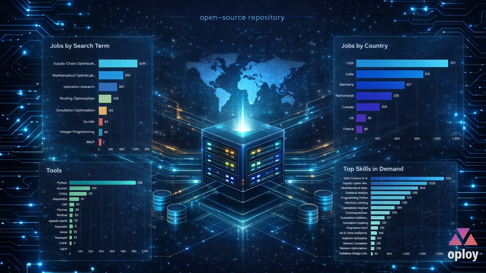
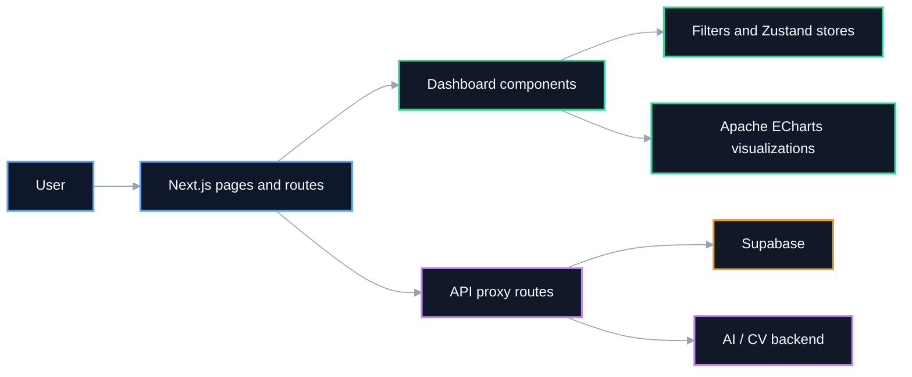
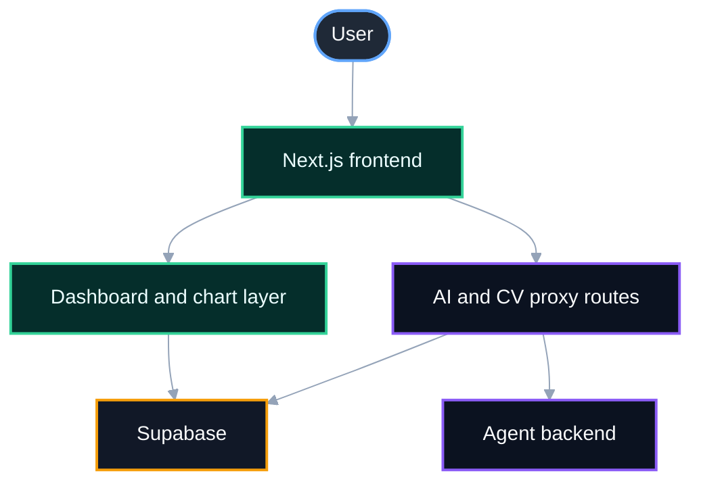

# Job Analytics Frontend

<p align="center">
  <a href="https://job.oploy.eu/">
    
  </a>
</p>


Next.js frontend for interactive job analytics dashboards, AI chat, CV matching, and search workflows connected to Supabase and backend services.

> ⭐ If this project is useful for your work or research, consider starring it to support visibility and future development.

This repository contains the user-facing dashboard experience behind the JobLab product direction visible on `job.oploy.eu`. It focuses on analytics presentation, filtering, charting, AI-assisted exploration, CV matching flows, and job search interfaces.

## Overview

The frontend is responsible for presenting job data in a way that is both exploratory and actionable.

Main user-facing capabilities include:

- interactive dashboards built with Mantine and Apache ECharts
- KPI cards and filter-driven analytics views
- direct job search and lookup workflows
- AI chat interface for job-related exploration
- CV matching UI connected to backend matching services

## Core features

- Next.js App Router architecture
- Mantine-based UI components and layout system
- Apache ECharts-based analytical visualizations
- Supabase-backed data fetching and filters
- AI chat panels and response rendering
- CV matcher interface for job relevance workflows
- onboarding and first-visit user guidance
- dashboard-specific state management with Zustand

## Architecture

The following two diagrams serve different purposes:

- **Frontend system overview** shows how pages, API routes, backend services, and Supabase fit together.
- **User interaction flow** shows how users move between dashboards, search, chat, and CV matching features.

### 1. Frontend system overview

This diagram explains the high-level structure of the frontend and its connected services.



## Dashboard capabilities

The frontend includes multiple analytics surfaces built around chart-driven exploration. Based on the current component structure, the dashboard supports views such as:

- country and remote distribution charts
- education and function relationships
- industry and function analysis
- job function and job type charts
- heatmaps, time series, sunburst, treemap, and map views
- skills and tools visual summaries

These are implemented across the chart components in [`src/components/charts/`](Joblab%20frontend%20(appropriate%20name)/src/components/charts).

## AI, CV, and search features

The frontend is not only a dashboard. It also includes user-facing product features that connect analytics with action:

- **AI chat** for exploratory questions and interpretation
- **CV matcher** for comparing a user CV against job opportunities
- **job search and lookup** for direct retrieval and review of postings

Relevant UI and API route areas include:

- [`src/components/ai/`](Joblab%20frontend%20(appropriate%20name)/src/components/ai)
- [`src/components/dashboard/`](Joblab%20frontend%20(appropriate%20name)/src/components/dashboard)
- [`src/components/filters/`](Joblab%20frontend%20(appropriate%20name)/src/components/filters)
- [`src/app/api/`](Joblab%20frontend%20(appropriate%20name)/src/app/api)

## Project structure

```text
.
├── public/
├── src/
│   ├── app/
│   │   ├── api/
│   │   └── dashboard/
│   ├── components/
│   │   ├── ai/
│   │   ├── charts/
│   │   ├── dashboard/
│   │   ├── filters/
│   │   ├── jobs/
│   │   └── layout/
│   ├── lib/
│   ├── providers/
│   ├── store/
│   └── types/
├── .env.example
├── .gitignore
├── AGENTS.md
├── LICENSE
├── README.md
└── package.json
```

## Recommended public repository name

Recommended GitHub repository name: **`job-analytics-frontend`**

Alternative acceptable names:

- `job-dashboard-frontend`
- `joblab-frontend`
- `job-insights-dashboard`

## Setup

### Prerequisites

- Node.js 20+
- npm
- Supabase project with the required job data
- optional backend for AI chat and CV matching

### Installation

```powershell
npm install
Copy-Item .env.example .env.local
npm run dev
```

Then open `http://localhost:3000/dashboard`.

## Configuration

Main variables are documented in [`.env.example`](Joblab%20frontend%20(appropriate%20name)/.env.example).

| Variable | Required | Description |
|---|---:|---|
| `NEXT_PUBLIC_SUPABASE_URL` | yes | Public Supabase URL for client-side data access |
| `NEXT_PUBLIC_SUPABASE_ANON_KEY` | yes | Public anon key for browser usage |
| `SUPABASE_SERVICE_ROLE_KEY` | server routes only | Service role for trusted server-side API routes |
| `SUPABASE_URL` | optional | Server-side fallback URL |
| `LLM_BACKEND_URL` | optional | Backend URL for AI chat and CV matching proxy routes |
| `NEXT_PUBLIC_SITE_URL` | optional | Canonical site URL for SEO metadata |

## Available scripts

```powershell
npm run dev
npm run build
npm run start
npm run lint
```

## Deployment

Deployment is optional and intentionally placed after the main product explanation.

The public deployment shape for this repository is typically:

- Next.js frontend deployment
- Supabase as the main data source
- backend API integration for AI chat and CV matching

### Deployment overview



## SEO and discoverability

This repository is intentionally documented with search-friendly terms such as:

- Next.js job analytics dashboard
- Mantine dashboard frontend
- Apache ECharts job market visualization
- Supabase-connected job dashboard
- AI chat and CV matching frontend

These terms help both search engines and LLM-based discovery systems understand the repository purpose.

## What was cleaned for open-source publication

This public version excludes or replaces:

- committed secrets and real Supabase credentials
- local `.env` files
- generated TypeScript build artifacts
- local-only backend URLs

## License

This repository is licensed under the MIT License. See [`LICENSE`](Joblab%20frontend%20(appropriate%20name)/LICENSE).
